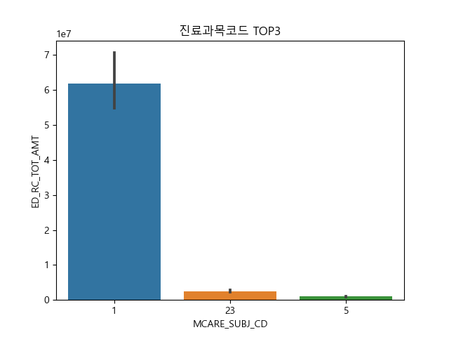

# Join Collection NSC2

## 분석목적
- 주어진 데이터를 해석하고 분석할 목적을 결정 할 수 있는가
- 분석 목적에 맞게 목표변수와 그에 영향을 주는 설명변수를 뽑아낼 수 있는가
- 목표변수와 설명변수의 상관관계를 확인하고 각 상관관계에 맞는 분석법을 적용할 수 있는가
  위의 3가지를 수행할 능력을 다지는 연습을 목적으로 분석을 진행하게 되었다

## 분석 진행 순서
DDA 
- 선택한 설정변수 중 각자 분석을 맡은 컬럼을 추출하고,
     컬럼 별 데이터 타입과 정보를 확인하여 연속형(int)에서 범주형(object)으로 변경하는 작업을 진행.

EDA 
- 범주형/연속형에 따라서 그래프를 통해 시각화를하여 목표변수에 영향 여부를 예측해 봄. 

CDA 
- 목표변수와 설명변수의 관계를 검증하여 p-value값을 통해 수치적으로 영향 여부를 판단함.

변수 선택 이유 

| 변수    | 변수의 설명   | 데이터 분류 | 변수 선택 이유 |
|----------|----------|---------|-----------|
| ED_RC_TOT_AMT   | 의료급여 총금액                                               | 연속형 | 아래의 설명변수의 영향을 받는지 알아보기 위한 목표변수로 설정.|
| MCARE_SUBJ_CD   | 진료 과목 코드 (실제 진료를 받은 진료과목 )                   | 범주형 | 진료 항목마다 검사 종류, 장비 등이 다르기 때문에 진료 종류에 따라 목적 변수인 병원비가 크게 차이날 것이라고 생각되어 선택 |
| OPRTN_YN        | 수술 여부                                                     | 범주형 | 수술을 하고 안하고는 목적변수 병원비에 큰 영향을 끼칠 것이기 때문에 사실인지 확인해 보기 위해 선택 |
| MCARE_RSLT_TYPE | 진료결과구분(계속,이송,회송,사망,기타,퇴원 또는 외래치료 종결)| 범주형 | 결과가 이송이라면 이송비용과 이송 후 추가 검사 등의 비용, 사망이라면 병원비 추가 정지 등에 의해 진료 결과에 따라 목적변수 병원비가 영향을 받을 것이라고 판단하여 확인을 위해  설정변수로 선택 |
| EDC_SBA         | 심결본인부담금                                                | 연속형 | 본인부담금이 적은 치료, 검사라면 병원에서 적극 추천할 것이고, 환자의 부담도 적어 굳이 받지 않아도 될 검사와 치료를 받음으로써 목적변수인 병원비의 변동이 있을 것이라고 판단하여 확인을 위해 설정변수로 선택 |
| BTH_YYYY        | 환자 출생 연도                                                | 연속형 | 연령대별 회복속도, 치료방법, 보험적용에 차이가 있어 목적변수인 병원비가 큰 차이가 있을 것이라고 판단되어 확인을 위해 설정변수로 선택 |

## 일부 시각화 

진료과목코드 TOP3를 뽑아 분석하였음 
## 분석 스토리
| 변수    | 분석자   | pvalue | 성립가설 |
|----------|----------|---------|-----------|
| ED_RC_TOT_AMT   | 오가배, 김하늘 | null | 아래의 설명변수의 영향을 받는지 알아보기 위한 목적 변수로 설정.|
| MCARE_SUBJ_CD   | 김하늘         | 0.0407 | 대립가설 : 진료과목 코드에 따라 요양급여비용총액에 차이가 있다. |
| OPRTN_YN        | 김하늘         | 6.26251 | 귀무가설 : 진료결과에 따라 요양급여비용총액에 차이가 없다. |
| MCARE_RSLT_TYPE | 김하늘         | 0.00271 | 대립가설 : 수술 여부에 따라 요양급여비용총액에 차이가 있다. |
| EDC_SBA         | 오가배         | 0.0 | 대립가설 : 본인부담금은 병원비에 영향을 준다. |
| BTH_YYYY        | 오가배         | 0.1608 | 귀무가설 : 출생년도와 병원비는 관계가 없다.  |

### 분석결과 
- 수술여부와 진료과목코드, 본인부담금이 요양급여비용총액에 영향을 미친다는 것을 확인하였음.
- 나이대별 요양급여비용총액이 다를 것이라고 생각되어 출생년도를 역으로 계산하여 연령을 추출, 목표변수에 영향을 주는지 분석을 시도해보았으나, 연령대별 진단질병, 연령별 합병증, 가입한 보험등의 컬럼을 생성하고, 데이터를 분리하여 분석을 진행해야 정확한 분석결과를 도출할 수 잇는 까다로운 컬럼이였다 시간과 분석능력에 한계를 느끼고 추가 작업을 진행하지 못하였다.
- 

## 분석 후  느낀점 
오가배 
- 연령에 따라 요양급여비용총액에 어떠한 영향을 미치는지 파악하고자 출생년도를 선택하였나, 현재를 기준으로 연령을 뽑을수는 있으나 환자가 이미 사망했을수도 있고, 1910년대 이전 출생자는 정확한 출생년도를 파악할수가 없었다. 고로, 사망년자를 통해 정확한 연령을 추출하거나, 1910년대 이전 출생자를 제외하고 분석을 하거나 등으로 조금 더 정확한 분석을 해야 함을 느끼게 되었다. 
