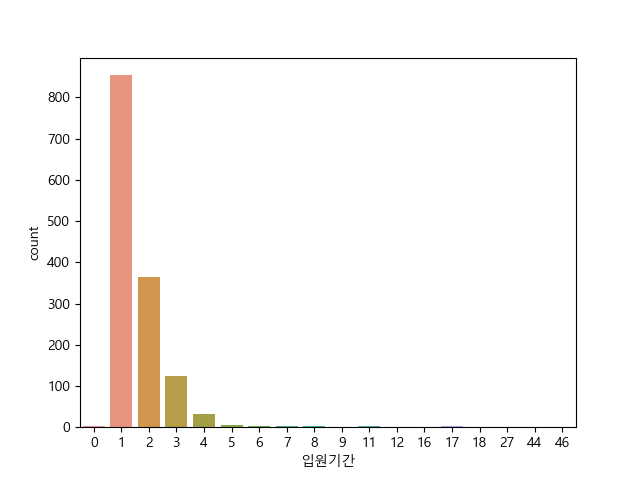
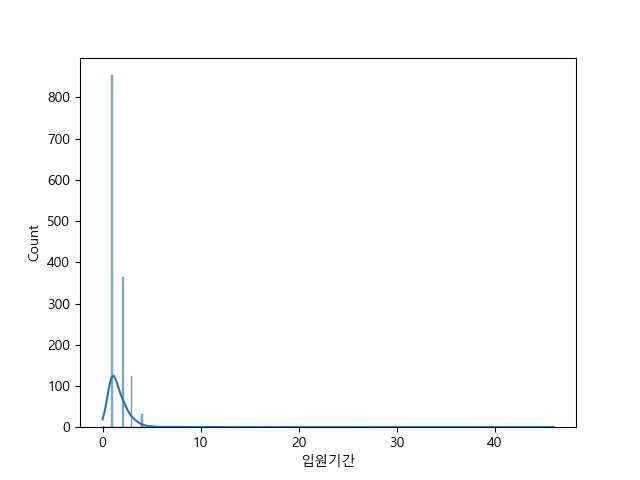
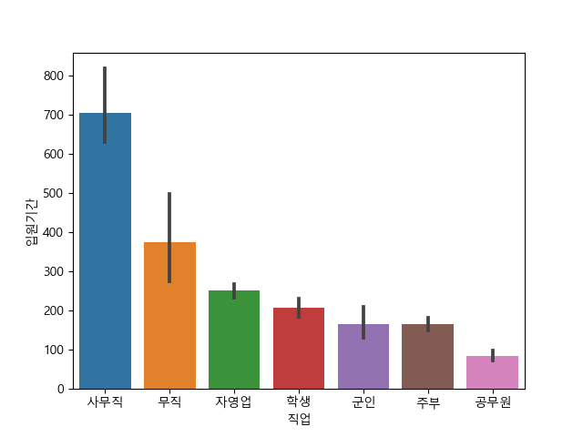
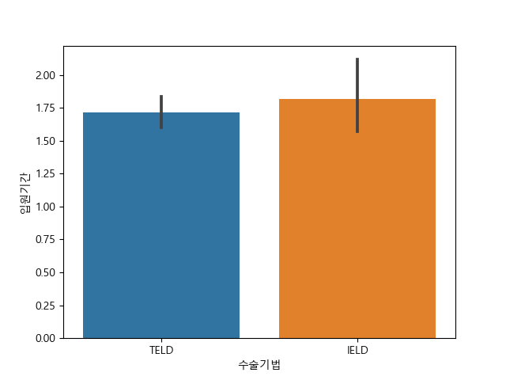

# Recurrence Of Surgery(수술 재발)

## 분석목적
입원기간에 영향을 미칠 것으로 예상되는 변수들을 설정하여 데이터 탐색 및 분석을 통해 해당 변수들과 입원기간 간의 관계를 파악하고자 한다.

## 분석 진행 순서
DDA 
- 선택한 설정변수 중 각자 분석을 맡은 컬럼을 추출하고,
     컬럼 별 데이터 타입과 정보를 확인하여 연속형(int)에서 범주형(object)으로 변경하는 작업을 진행.

EDA 
- 범주형/연속형에 따라서 그래프를 통해 시각화를하여 목표변수에 영향 여부를 예측해 봄. 

CDA 
- 목표변수와 설명변수의 관계를 검증하여 p-value값을 통해 수치적으로 영향 여부를 판단함.

변수 선택 이유 

### DDA 분석
| 변수    | 변수의 설명   | 데이터 분류 | 변수 선택 이유 |
|------|------|-----|------|
| 입원기간   | 입원 기간   | 날짜형 | 입원기간에 영향을 미치는 것들을 분석해보고자 함|
| 직업     | 환자의 직업   | 명목형  |         |
| 체중   | 환자의 체중   | 연속형 | 체중', '신장' 을 통해 BMI를 추출하여 입원기간에 영향을 미치는지 확인하고자 함.|
| 연령     | 환자의 연령   | 연속형  | 흔히 저연령층이 회복력이 빨라 입원기간이 짧다고 생각되어지는데 해당 사실이 맞는지 통계적 수치로 확인하고자 함.|
| 환자통증정도  | 환자의 통증 정도 | 이산형 | 수치적인 의미를 가지나 소수점의 형태로 표현되지 못하는 데이터 |
| 통증기간(월)   | 통증 기간 (월) | 이산형 | 정수 데이터값을 가지는 데이터  |
| 당뇨여부   | 당뇨 여부 | 명목형     | 해당 존재 여부만을 나타내는 데이터  |
| 심혈관질환   | 심혈관질환 여부 | 명목형    | 해당 존재 여부만을 나타내는 데이터 |
| 암발병여부  | 암 발병 여부   | 명목형  |해당 존재 여부만을 나타내는 데이터  |
| 수술기법     | 수술 기법  |명목형 | 분류를 목적으로 하는 데이터 |
| 전방디스크높이(mm) | 전방 디스크 높이  | 연속형  |높이가 어떤 영향을 미쳐 입원기간에 영향을 끼치는지 확인하고자 함.|
| 후방디스크높이(mm)  | 후방 | 연속형  | 높이가 어떤 영향을 미쳐 입원기간에 영향을 끼치는지 확인하고자 함.|
| PI    | PI              |연속형 | 곡률이 클수록 입원기간에 영향을 미치는  정도를 파악하고자 함.|
| 디스크단면적    | 디스크 단면적      |연속형 | 해당 크기가 입원기간에 어떤 영향을 끼치는지 확인하고자 함.|
| 디스크위치   | 디스크 위치        |이산형 | 위치가 입원기간에 어떤 영향을 끼치는지 확인하고자 함.|

## 일부 시각화 : 

 목적변수인 입원기간의 시각화 

직업의 상위권 데이터를  시각화 

입원기간에 따른 수술기법을 시각화 

## 분석 스토리 
### 분석결과 수치
| 변수             | 분석자         | p-value 값 | 분석결과        |
|------------------|--------------|------------|---------------|
| 직업              | 김하늘    | P.value=0.018 |대립가설 참, 직업에 따라 입원기간에 차이가 있다.|
| 체중              | 오가배   | pvalue=0.0  |귀무가설 참, 체중에 따라서 입원기간 변화가 없다.|
| 연령              |  오가배  |pvalue=0.00078 |대립가설 참, 연령에 따라서 입원기간 변화가 있다. |
| 신장             | 오가배   | pvalue=0.8863 | 귀무가설 참, 신장에 따라서 입원기간 변화가 없다.|
| 환자통증정도      |  김하늘      |P.value=2.9801..|귀무가설 참, 환자 통증 정도는 입원기간에 영향을 주지 않는다.|
| 통증기간(월)      |  김하늘       |P.value=0.6342.. |귀무가설 참, 통증기간(월)은 입원기간에 영향을 주지 않는다. |
| 당뇨여부          |   김하늘       |P.value=0.5845.. |귀무가설 참, 당뇨 여부에 따라 입원기간에 차이가 없다. |
| 심혈관질환        |  김하늘      |P.value=0.617..|귀무가설 참, 심혈관질환 여부에 따라 입원기간에 차이가 없다.|
| 암발병여부        | 김하늘       | P.value=0.6588..| 귀무가설 참, 암발병 여부에 따라 입원기간에 차이가 없다.|
| 수술기법          |  오가배  |pvalue=1.0  |귀무가설 참, 입원기간 평균에 차이 없다.|
| 전방디스크높이(mm) |   오가배     | pvalue=0.8712|귀무가설 참, 전방디스크높이에 따라서 입원기간 변화가 없다.|
| 후방디스크높이(mm) |   오가배    |pvalue=0.0520 |귀무가설 참,후방디스크높이에 따라서 입원기간 변화가 없다. |
| PI               |  오가배 |pvalue=0.756 | 귀무가설 참, PI에 따라서 입원기간 변화가 없다  |
| 디스크단면적      |  오가배   |  pvalue=0.203| 귀무가설 참, 디스크단면적에 따라서 입원기간 변화가 없다. |
| 디스크위치        |   오가배   | pvalue=0.156| 귀무가설 참, 디스크위치에 따라서 입원기간 변화가 없다. |
| BMI | 오가배 |  pvalue=0.885 | 귀무가설 참, 입원기간 대비 BMI 분포의 평균에 차이가 없다.|

### 분석 결과 
- 연령과 직업이 입원기간에 영향을 미친다는 것을 확인함.
     - 직업은 상위3순위인 '사무직', '자영업', '무직'를 추출하여 분석하였으며 해당 직업군이 척추에 연관성을 찾을 필요가 있음.
- '체중', '신장', '환자통증정도', '통증기간(월)', '당뇨여부', '심혈관질환', '암발병여부', '전방디스크높이(mm)', '후방디스크높이(mm)', '디스크단면적','디스크위치', 'PI', '수술기법'는 입원기간에 영향을 끼치지 않음을 확인함.
- '체중', '신장'를 토대로 BMI를 추출한 결과, BMI는 입원기간에 영향을 끼치지 않음을 확인함.
- 다만, 전방디스크높이보다 후방디스크높이가 입원기간에 영향을 미친다는 점을 알수 있었음.

## 분석 후  느낀점 
오가배 
- 연속형/연속형의 데이터 분서기 해당 그래프를 해석하는것에 어려움을 느꼈다. 연속형일 경우 해당 데이터를 온전히 분석하기보다는 상위/하위 또는 범주를 분류하여 분석을 하면 보다 자세한 분석을 할수 있음을 깨닫게 되었다. 또한 분석을 하기에 앞서 correlation을 먼저 확인한다면 영향여부를 미리 파악할수 있다는점 또한 확실히 알게 되었다. 
